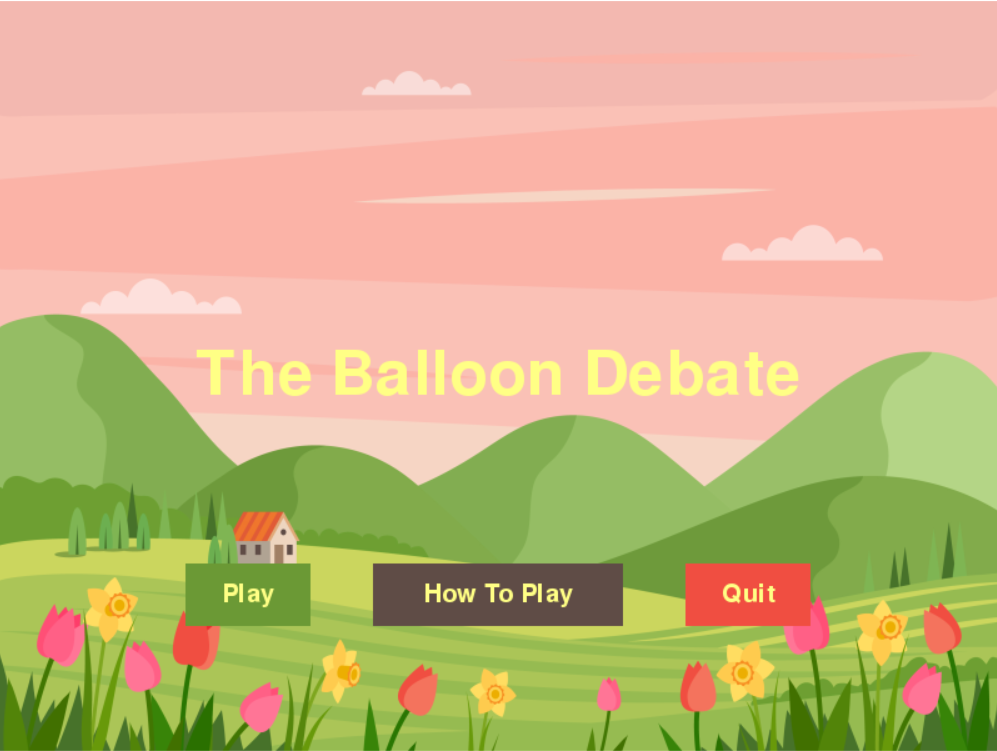

## :balloon: The Balloon Debate 

An English language learning game created using **pygame**. 
Recommended for students attaining a B2 in English. 

The students must enter their names into the game. The game will attach a random invention to their name. 
When the game starts the hot air balloon will fall at a constant rate for the selected amount of time.
If the students run out of time the hot air balloon will crash. 
If the students do finish then they each enter which invention they want to throw overboard. 
The game will then reveal the loser, throwing the invention out of the hot air balloon.  

## :beginner: Motivation

I decided to add a visual element to a roleplaying game I played with my students, to be used in future lessons. This game seemed to most viable. 
The program has a interactive element with a simple GUI to enter details, but does not restrict students from talking to eachother. 
Once all their names have been entered, the balloon falls and they can debate amongst themselves. They can look at the screen every once in a while 
to guess how much time they have left, this puts them on the spot and encourages the students to use more improvised language. 

##  :camera: Gallery

**Start up screen**

**Example of input GUI**

**The main part of the game**

## :star2: Credit/Acknowledgment
 
Used some functions from: https://github.com/StevePaget/Pygame_Functions
